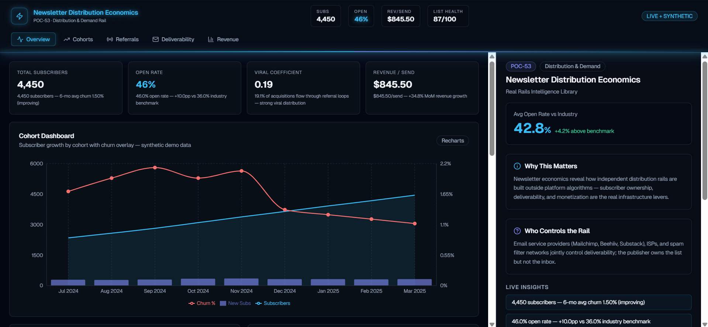

# POC-53 — Newsletter Distribution Economics

Real Rails Intelligence Library demo for the **Distribution & Demand** rail. Explore subscriber cohorts, referral loops, deliverability, sponsorship revenue, and publisher-owned distribution economics.

  

## Quick Start

### Prerequisites
- Node.js 18+
- Python 3.11+ (use `py` launcher on Windows)

### 1. Backend

```powershell
cd backend
py -3 -m venv .venv
.\.venv\Scripts\python.exe -m pip install -r requirements.txt
.\.venv\Scripts\python.exe run.py
```

API runs at **http://localhost:8000**

### 2. Frontend

```powershell
cd frontend
copy .env.local.example .env.local
npm install
npm run dev
```

Dashboard at **http://localhost:3000**

> If the backend is offline, the UI automatically falls back to `public/mock_data.json`.

### Troubleshooting (dev server won't load)

Stop any running dev server first, then start with a clean cache:

```powershell
cd frontend
npm run dev:clean
```

Do not run `npm run build` while `npm run dev` is active — that can corrupt the `.next` cache.

## Features

- **Cohort Dashboard** — subscriber growth + churn overlay (Recharts)
- **Referral Loop Visualizer** — Sankey acquisition flows (ECharts)
- **Deliverability Flags** — open/bounce/spam vs industry benchmarks
- **Sponsor Revenue Model** — CPM, slots, revenue per send
- **Neon Glass Navbar** — full-width header with live ticker + section navigation
- **Intelligence Sidebar** — Why This Matters, Who Controls the Rail, filters, insights
- **CSV Export** — downloadable sample data (ZIP via API, CSV fallback)
- **World Bank Context** — live internet penetration & GDP indicators when backend runs

## Screenshot



## Project Structure

See [ARCHITECTURE.md](./ARCHITECTURE.md) for full system design, data flow, and component map.

```
├── backend/        # FastAPI service (stdlib JSON/CSV ETL)
├── frontend/       # Next.js 14 dashboard
├── Screenshots/    # Demo screenshots
├── ARCHITECTURE.md
└── README.md
```

## Environment Variables

**Backend** (`backend/.env`):
```
WORLD_BANK_API_BASE=https://api.worldbank.org/v2
MOCK_DATA_PATH=./data/mock_data.json
```

**Frontend** (`frontend/.env.local`):
```
NEXT_PUBLIC_API_URL=http://localhost:8000
```

## Data Sources

| Data | Type | Label |
|------|------|-------|
| Newsletter metrics | Synthetic | Clearly labeled in UI |
| World Bank indicators | Live public API | Hybrid mode when backend runs |

## API Endpoints

| Endpoint | Description |
|----------|-------------|
| `GET /health` | Health check |
| `GET /api/dashboard` | Full dashboard JSON |
| `GET /api/export` | ZIP of CSV files |
| `GET /api/mock` | Raw mock data |

## License

POC for Real Rails Interns Batch 4.
